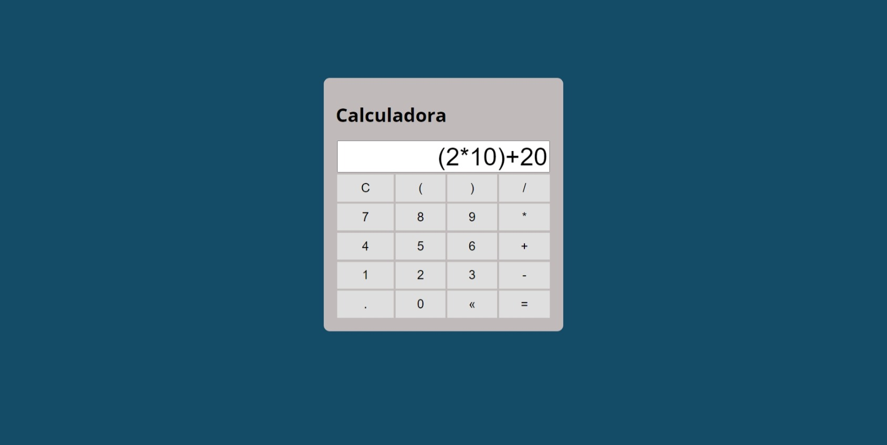

  

## 🖥️ Projeto
Esse é um projeto Web Responsivo, de uma calculadora que realiza as 4 principais operações matemáticas (+, -, *, /) e exponenciação.

## 🚀 Tecnologias
Esse projeto foi desenvolvido com as seguintes tecnologias:

- HTML
- CSS
- JS
- Git e Github
